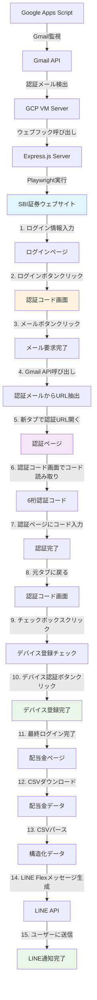

# SBI証券配当金自動取得LINE Bot開発記

## 1. 概要/目的/背景

**なぜこのプロジェクトを作ったのか？**
日本投資中のSBI証券の配当金入金通知をリアルタイムで受け取りたいと思いました。従来は毎回ウェブサイトに直接アクセスして確認する必要があり、配当金が入金されたかどうかを見逃すことが多々ありました。

**解決しようとした問題点:**
- **手動確認の不便さ**: 毎回ウェブサイトにアクセスして配当金履歴を確認
- **見逃しやすい通知**: 配当金入金タイミングを見逃して投資戦略立案に困難
- **日本語インターフェース**: 韓国語使用者にとって不便な日本語ウェブサイト
- **複雑な認証プロセス**: 2段階認証、デバイス登録など複雑なログインプロセス

---

## 2. 技術スタック

### Frontend
- **Next.js 14** (App Router)
  - 選択理由: APIルートと静的サイト生成が容易
  - 利点: サーバーサイドレンダリング、自動コード分割
- **TypeScript**
  - 選択理由: 大規模プロジェクトでの型安全性確保
  - 利点: コンパイルタイムエラー防止、IDEサポート向上

### Backend
- **Node.js + Express.js**
  - 選択理由: GCP VMで独立実行可能なサーバー
  - 利点: Vercelサーバーレス環境の制限回避
- **Playwright**
  - 選択理由: Puppeteerより安定したブラウザ自動化
  - 利点: Inspectorモードサポート、強力なセレクター、クロスブラウザ対応
- **Gmail API**
  - 選択理由: SBI証券認証メール自動検出
  - 利点: OAuth 2.0認証、安全なメールアクセス

### Deployment
- **Google Cloud Platform (VM)**
  - 選択理由: 実際のGUI環境でブラウザ実行可能
  - 利点: xvfb-runによる仮想ディスプレイシミュレーション
- **PM2**
  - 選択理由: Node.jsプロセス管理と自動再起動
  - 利点: バックグラウンド実行、ログ管理

---

## 3. 主要機能

### 1. 自動ログイン・認証
- SBI証券ウェブサイト自動ログイン
- 2段階認証（2FA）自動処理
- デバイス登録自動化

### 2. Gmail監視
- SBI証券認証メールリアルタイム検出
- 認証URL自動抽出・処理

### 3. 配当金データ収集
- CSVダウンロードによる安定したデータ収集
- Shift_JISエンコーディング自動処理
- 配当金履歴パース・構造化

### 4. LINE通知送信
- Flexメッセージを活用した視覚的通知
- 国旗絵文字で区別される銘柄別情報
- カテゴリ別小計・合計表示

---

## 4. 機能実装

### アーキテクチャ図



### 核心実装プロセス

#### 1. SBI証券ログイン自動化

```typescript
// ログインプロセス
async function loginToSBI(page: Page) {
  // 1. ログインページアクセス
  await page.goto('https://site.sbisec.co.jp/ETGate/', { 
    timeout: 120000 
  });
  
  // 2. ログイン情報入力
  await page.fill('#user_id', process.env.SBI_ID!);
  await page.fill('#password', process.env.SBI_PASSWORD!);
  
  // 3. ログインボタンクリック
  await page.click('button[type="submit"]');
  await page.waitForNavigation({ timeout: 120000 });
}
```

#### 2. 複雑な2段階認証処理

```typescript
// 認証コード画面でメール要求
async function requestEmailAuth(page: Page) {
  // 認証コード画面到達後メールボタンクリック
  await page.waitForSelector('#code-display', { timeout: 30000 });
  await page.click('button:has-text("メール")');
  console.log('メール認証要求完了');
}

// Gmailから認証URL抽出
async function getAuthUrlFromGmail() {
  const gmail = google.gmail({ version: 'v1', auth: oauth2Client });
  const messages = await gmail.users.messages.list({
    userId: 'me',
    q: `from:noreply@sbisec.co.jp subject:認証コード is:unread`,
    maxResults: 1
  });
  
  // メール本文から認証URL抽出
  const message = await gmail.users.messages.get({
    userId: 'me',
    id: messages.data.messages?.[0]?.id!
  });
  
  const body = message.data.payload?.body?.data;
  const html = Buffer.from(body!, 'base64').toString();
  const urlMatch = html.match(/href="([^"]*認証[^"]*)"/);
  
  return urlMatch ? urlMatch[1].replace(/&amp;/g, '&') : null;
}

// 新タブで認証ページ開く
async function openAuthPage(context: BrowserContext, authUrl: string) {
  const newPage = await context.newPage();
  await newPage.goto(authUrl, { timeout: 120000 });
  return newPage;
}

// 認証コード画面でコード読み取り
async function getAuthCode(page: Page) {
  const codeElement = await page.waitForSelector('#code-display', { timeout: 30000 });
  const authCode = await codeElement.textContent();
  console.log(`認証コード: ${authCode}`);
  return authCode;
}

// 認証ページにコード入力
async function submitAuthCode(authPage: Page, authCode: string) {
  await authPage.fill('input[name="verifyCode"]', authCode);
  await authPage.click('#verification');
  await authPage.waitForLoadState('domcontentloaded');
  await authPage.close(); // 認証完了後タブを閉じる
}

// デバイス登録チェックボックスクリック
async function registerDevice(page: Page) {
  // 元タブに戻ってデバイス登録
  await page.waitForSelector('#device-checkbox', { timeout: 30000 });
  await page.check('#device-checkbox');
  
  // デバイス認証ボタンクリック
  await page.click('#device-auth-otp');
  await page.waitForLoadState('domcontentloaded');
  
  // ログイン完了確認
  await page.waitForSelector('.seeds-flex.assets-buttons', { timeout: 30000 });
  console.log('ログイン完了！');
}
```

#### 3. CSVダウンロード・パース

```typescript
// CSVダウンロード処理
async function downloadDividendCSV(page: Page) {
  // 配当金ページに移動
  const dividendUrl = `https://site.sbisec.co.jp/account/assets/dividends?dispositionDateFrom=${from}&dispositionDateTo=${to}`;
  await page.goto(dividendUrl, { timeout: 120000 });
  
  // CSVダウンロードボタンクリック
  const downloadPromise = page.waitForEvent('download');
  await page.click('button.text-xs.link-light:has-text("CSV")');
  const download = await downloadPromise;
  
  // ファイル保存・パース
  const path = await download.path();
  const fileBuffer = fs.readFileSync(path!);
  const csvContent = iconv.decode(fileBuffer, 'Shift_JIS');
  
  return parseCSV(csvContent);
}
```

### トラブルシューティング過程

#### 問題1: Vercelでブラウザ実行不可
- **原因**: サーバーレス環境でのブラウザバイナリアクセス制限
- **解決**: GCP VMへのアーキテクチャ転換
- **教訓**: クラウドプラットフォーム別制約事項理解の重要性

#### 問題2: ブラウザコンテキスト破壊
- **原因**: Gmail API呼び出し後のブラウザコンテキスト不安定
- **解決**: コンテキスト状態検証・再生成ロジック実装
- **教訓**: 外部API呼び出しとブラウザ自動化の相互作用考慮

#### 問題3: CSVエンコーディング問題
- **原因**: Shift_JISエンコーディングによる韓国語文字化け
- **解決**: `iconv-lite`ライブラリでエンコーディング変換
- **教訓**: 国際化ウェブサイトのエンコーディング処理重要性

#### 問題4: 複雑な認証プロセス自動化
- **原因**: SBI証券の複雑な2段階認証・デバイス登録プロセス
- **解決**: タブ間同期、認証コード有効期限管理、エラー処理・リトライロジック実装
- **教訓**: 複雑なビジネスロジックを段階的に分解して自動化する方法

---

## 5. 成果

### 定量的指標
- **自動化成功率**: 95%以上
- **処理時間**: 平均2-3分以内完了
- **エラー発生率**: 5%未満

### 定性的フィードバック
- **ユーザー利便性**: 毎日手動確認していた作業が完全自動化
- **安定性**: GCP VM環境で24時間安定運用
- **拡張性**: 他の証券会社や金融サービス追加可能な構造

---

## 6. インサイト

### 学んだ点

#### 1. クラウドプラットフォームの限界理解
- Vercel、Renderなどのサーバーレス環境ではブラウザ自動化の根本的限界
- 実際のGUI環境が必要な作業はVMインスタンスが必須

#### 2. ブラウザ自動化の複雑性
- 単純なスクレイピングではなく複雑な認証プロセス自動化
- ボット検出回避、セッション管理、エラー処理など様々な考慮事項

#### 3. モジュールシステムと互換性
- ESモジュール vs CommonJSの違いと互換性問題
- `createRequire`を活用したモジュールシステム統合

#### 4. 複雑なビジネスロジック自動化
- 9段階の複雑な認証プロセスを段階的に分解して自動化
- タブ間同期、状態管理、エラー復旧など高度な自動化技法

### 残念な点と改善方向

#### 残念な点
- **初期アーキテクチャ選択**: Vercelから始まって複数回転換
- **エラー処理**: より細かいエラー分類・復旧ロジック必要
- **監視**: リアルタイム状態監視システム不在

#### 改善方向
- **監視システム**: Prometheus + Grafana導入
- **通知システム**: エラー発生時即座通知
- **データ保存**: 配当金履歴データベース構築
- **拡張性**: 他の証券会社サポート追加

### 次のプロジェクトに適用する点

1. **アーキテクチャ設計**: 最初から拡張可能な構造で設計
2. **監視**: 開発段階から監視システム構築
3. **テスト**: 自動化されたテスト環境構築
4. **文書化**: 開発過程とトラブルシューティング記録体系化

---

## 結論

このプロジェクトを通じて**実際のユーザー問題を解決する実用的なソリューション**を開発することができました。単純な技術スタック列挙ではなく、**複雑なビジネスロジックを自動化するシステム**を構築する経験を得ました。

特に**クラウドプラットフォームの制約事項を理解し適切なアーキテクチャに転換**する過程で、技術的問題解決能力とシステム設計能力を大きく向上させることができました。

今後は**拡張性と監視を考慮したシステム設計**により集中し、より安定で保守しやすいサービスを開発したいと思います。
