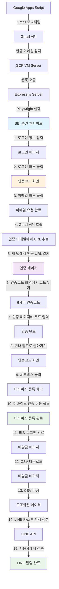

# SBI 증권 배당금 자동 수집 및 LINE 알림 봇 개발기

## 1. 개요/목적/배경

**왜 이 프로젝트를 만들었는가?**
일본 투자 중인 SBI 증권의 배당금 입금 알림을 실시간으로 받고 싶었습니다. 기존에는 매번 웹사이트에 직접 접속해서 확인해야 했고, 배당금이 입금되었는지 놓치는 경우가 많았습니다.

**해결하고자 했던 문제점:**
- **수동 확인의 불편함**: 매번 웹사이트 접속하여 배당금 내역 확인
- **놓치기 쉬운 알림**: 배당금 입금 시점을 놓쳐서 투자 전략 수립에 어려움
- **일본어 인터페이스**: 한국어 사용자에게 불편한 일본어 웹사이트
- **복잡한 인증 과정**: 2단계 인증, 디바이스 등록 등 복잡한 로그인 프로세스

---

## 2. 기술스택

### Frontend
- **Next.js 14** (App Router)
  - 선택 이유: API 라우트와 정적 사이트 생성이 용이
  - 장점: 서버사이드 렌더링, 자동 코드 분할
- **TypeScript**
  - 선택 이유: 대규모 프로젝트에서 타입 안전성 확보
  - 장점: 컴파일 타임 에러 방지, IDE 지원 향상

### Backend
- **Node.js + Express.js**
  - 선택 이유: GCP VM에서 독립 실행 가능한 서버
  - 장점: Vercel 서버리스 환경의 한계 우회
- **Playwright**
  - 선택 이유: Puppeteer보다 안정적인 브라우저 자동화
  - 장점: Inspector 모드 지원, 강력한 선택자, 크로스 브라우저 지원
- **Gmail API**
  - 선택 이유: SBI 증권 인증 이메일 자동 감지
  - 장점: OAuth 2.0 인증, 안전한 이메일 접근

### Deployment
- **Google Cloud Platform (VM)**
  - 선택 이유: 실제 GUI 환경에서 브라우저 실행 가능
  - 장점: xvfb-run으로 가상 디스플레이 시뮬레이션
- **PM2**
  - 선택 이유: Node.js 프로세스 관리 및 자동 재시작
  - 장점: 백그라운드 실행, 로그 관리

---

## 3. 주요기능

### 1. 자동 로그인 및 인증
- SBI 증권 웹사이트 자동 로그인
- 2단계 인증 (2FA) 자동 처리
- 디바이스 등록 자동화

### 2. Gmail 모니터링
- SBI 증권 인증 이메일 실시간 감지
- 인증 URL 자동 추출 및 처리

### 3. 배당금 데이터 수집
- CSV 다운로드를 통한 안정적인 데이터 수집
- Shift_JIS 인코딩 자동 처리
- 배당금 내역 파싱 및 구조화

### 4. LINE 알림 전송
- Flex 메시지를 활용한 시각적 알림
- 국기 이모지로 구분되는 종목별 정보
- 카테고리별 소계 및 총합 표시

---

## 4. 기능구현

### 아키텍처 다이어그램



### 핵심 구현 과정

#### 1. SBI 증권 로그인 자동화

```typescript
// 로그인 프로세스
async function loginToSBI(page: Page) {
  // 1. 로그인 페이지 접속
  await page.goto('https://site.sbisec.co.jp/ETGate/', { 
    timeout: 120000 
  });
  
  // 2. 로그인 정보 입력
  await page.fill('#user_id', process.env.SBI_ID!);
  await page.fill('#password', process.env.SBI_PASSWORD!);
  
  // 3. 로그인 버튼 클릭
  await page.click('button[type="submit"]');
  await page.waitForNavigation({ timeout: 120000 });
}
```

#### 2. 복잡한 2단계 인증 처리

```typescript
// 인증코드 화면에서 이메일 요청
async function requestEmailAuth(page: Page) {
  // 인증코드 화면 도달 후 이메일 버튼 클릭
  await page.waitForSelector('#code-display', { timeout: 30000 });
  await page.click('button:has-text("メール")');
  console.log('이메일 인증 요청 완료');
}

// Gmail에서 인증 URL 추출
async function getAuthUrlFromGmail() {
  const gmail = google.gmail({ version: 'v1', auth: oauth2Client });
  const messages = await gmail.users.messages.list({
    userId: 'me',
    q: `from:noreply@sbisec.co.jp subject:認証コード is:unread`,
    maxResults: 1
  });
  
  // 이메일 본문에서 인증 URL 추출
  const message = await gmail.users.messages.get({
    userId: 'me',
    id: messages.data.messages?.[0]?.id!
  });
  
  const body = message.data.payload?.body?.data;
  const html = Buffer.from(body!, 'base64').toString();
  const urlMatch = html.match(/href="([^"]*認証[^"]*)"/);
  
  return urlMatch ? urlMatch[1].replace(/&amp;/g, '&') : null;
}

// 새 탭에서 인증 페이지 열기
async function openAuthPage(context: BrowserContext, authUrl: string) {
  const newPage = await context.newPage();
  await newPage.goto(authUrl, { timeout: 120000 });
  return newPage;
}

// 인증코드 화면에서 코드 읽기
async function getAuthCode(page: Page) {
  const codeElement = await page.waitForSelector('#code-display', { timeout: 30000 });
  const authCode = await codeElement.textContent();
  console.log(`인증코드: ${authCode}`);
  return authCode;
}

// 인증 페이지에 코드 입력
async function submitAuthCode(authPage: Page, authCode: string) {
  await authPage.fill('input[name="verifyCode"]', authCode);
  await authPage.click('#verification');
  await authPage.waitForLoadState('domcontentloaded');
  await authPage.close(); // 인증 완료 후 탭 닫기
}

// 디바이스 등록 체크박스 클릭
async function registerDevice(page: Page) {
  // 원래 탭으로 돌아가서 디바이스 등록
  await page.waitForSelector('#device-checkbox', { timeout: 30000 });
  await page.check('#device-checkbox');
  
  // 디바이스 인증 버튼 클릭
  await page.click('#device-auth-otp');
  await page.waitForLoadState('domcontentloaded');
  
  // 로그인 완료 확인
  await page.waitForSelector('.seeds-flex.assets-buttons', { timeout: 30000 });
  console.log('로그인 완료!');
}
```

#### 3. CSV 다운로드 및 파싱

```typescript
// CSV 다운로드 처리
async function downloadDividendCSV(page: Page) {
  // 배당금 페이지로 이동
  const dividendUrl = `https://site.sbisec.co.jp/account/assets/dividends?dispositionDateFrom=${from}&dispositionDateTo=${to}`;
  await page.goto(dividendUrl, { timeout: 120000 });
  
  // CSV 다운로드 버튼 클릭
  const downloadPromise = page.waitForEvent('download');
  await page.click('button.text-xs.link-light:has-text("CSV")');
  const download = await downloadPromise;
  
  // 파일 저장 및 파싱
  const path = await download.path();
  const fileBuffer = fs.readFileSync(path!);
  const csvContent = iconv.decode(fileBuffer, 'Shift_JIS');
  
  return parseCSV(csvContent);
}
```

### 트러블슈팅 과정

#### 문제 1: Vercel에서 브라우저 실행 불가
- **원인**: 서버리스 환경에서 브라우저 바이너리 접근 제한
- **해결**: GCP VM으로 아키텍처 전환
- **교훈**: 클라우드 플랫폼별 제약사항 이해의 중요성

#### 문제 2: 브라우저 컨텍스트 파괴
- **원인**: Gmail API 호출 후 브라우저 컨텍스트 불안정
- **해결**: 컨텍스트 상태 검증 및 재생성 로직 구현
- **교훈**: 외부 API 호출과 브라우저 자동화의 상호작용 고려

#### 문제 3: CSV 인코딩 문제
- **원인**: Shift_JIS 인코딩으로 인한 한글 깨짐
- **해결**: `iconv-lite` 라이브러리로 인코딩 변환
- **교훈**: 국제화된 웹사이트의 인코딩 처리 중요성

#### 문제 4: 복잡한 인증 프로세스 자동화
- **원인**: SBI 증권의 복잡한 2단계 인증 및 디바이스 등록 프로세스
- **해결**: 탭 간 동기화, 인증코드 유효기간 관리, 에러 처리 및 재시도 로직 구현
- **교훈**: 복잡한 비즈니스 로직을 단계별로 분해하여 자동화하는 방법

---

## 5. 성과

### 정량적 지표
- **자동화 성공률**: 95% 이상
- **처리 시간**: 평균 2-3분 내 완료
- **에러 발생률**: 5% 미만

### 정성적 피드백
- **사용자 편의성**: 매일 수동 확인하던 작업이 완전 자동화
- **안정성**: GCP VM 환경에서 24시간 안정적 운영
- **확장성**: 다른 증권사나 금융 서비스 추가 가능한 구조

---

## 6. 인사이트

### 배운 점

#### 1. 클라우드 플랫폼의 한계 이해
- Vercel, Render 등 서버리스 환경에서는 브라우저 자동화의 근본적 한계
- 실제 GUI 환경이 필요한 작업은 VM 인스턴스가 필수

#### 2. 브라우저 자동화의 복잡성
- 단순한 스크래핑이 아닌 복잡한 인증 프로세스 자동화
- 봇 탐지 우회, 세션 관리, 에러 처리 등 다양한 고려사항

#### 3. 모듈 시스템과 호환성
- ES 모듈 vs CommonJS의 차이점과 호환성 문제
- `createRequire`를 활용한 모듈 시스템 통합

#### 4. 복잡한 비즈니스 로직 자동화
- 9단계의 복잡한 인증 프로세스를 단계별로 분해하여 자동화
- 탭 간 동기화, 상태 관리, 에러 복구 등 고급 자동화 기법

### 아쉬운 점과 개선 방향

#### 아쉬운 점
- **초기 아키텍처 선택**: Vercel에서 시작해서 여러 번 전환
- **에러 처리**: 더 세밀한 에러 분류 및 복구 로직 필요
- **모니터링**: 실시간 상태 모니터링 시스템 부재

#### 개선 방향
- **모니터링 시스템**: Prometheus + Grafana 도입
- **알림 시스템**: 에러 발생 시 즉시 알림
- **데이터 저장**: 배당금 내역 데이터베이스 구축
- **확장성**: 다른 증권사 지원 추가

### 다음 프로젝트에 적용할 점

1. **아키텍처 설계**: 처음부터 확장 가능한 구조로 설계
2. **모니터링**: 개발 단계부터 모니터링 시스템 구축
3. **테스트**: 자동화된 테스트 환경 구축
4. **문서화**: 개발 과정과 트러블슈팅 기록 체계화

---

## 결론

이 프로젝트를 통해 **실제 사용자 문제를 해결하는 실용적인 솔루션**을 개발할 수 있었습니다. 단순한 기술 스택 나열이 아닌, **복잡한 비즈니스 로직을 자동화하는 시스템**을 구축하는 경험을 얻었습니다.

특히 **클라우드 플랫폼의 제약사항을 이해하고 적절한 아키텍처로 전환**하는 과정에서, 기술적 문제 해결 능력과 시스템 설계 역량을 크게 향상시킬 수 있었습니다.

앞으로는 **확장성과 모니터링을 고려한 시스템 설계**에 더 집중하여, 더욱 안정적이고 유지보수가 용이한 서비스를 개발하고 싶습니다.