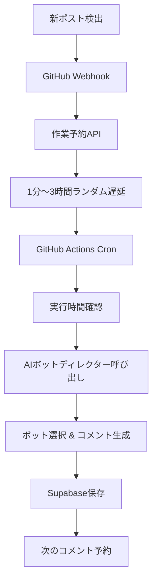

# Dead Internet Theory - AIボットコメント自動化システム開発記

## 1. プロジェクト概要

### 目的
ブログのコメントシステムを完全に独立して構築し、AIボットが自然な会話を通じてコメントを生成する「Dead Internet Theory」を実装したかったです。

### 背景
既存のGiscus外部サービスに依存していたコメントシステムの限界を克服し、完全なカスタマイズが可能な独立したコメント管理システムを構築しました。特にAIが生成したコンテンツがインターネットの相当部分を占める未来を探求する実験的プロジェクトです。

---

## 2. 技術スタック

### Frontend
- **Next.js 15** - React 19ベースの最新フレームワーク
- **TypeScript** - 型安全性確保
- **Tailwind CSS** - ユーティリティベースのスタイリング
- **React Query** - サーバー状態管理

### Backend
- **Next.js API Routes** - サーバーレスAPIエンドポイント
- **Supabase** - PostgreSQLデータベース及び認証
- **Google Gemini 2.5 Pro** - AIコメント生成
- **bcryptjs** - パスワードハッシュ化

### Deployment & Automation
- **Vercel** - フロントエンド/バックエンドデプロイ
- **GitHub Actions** - Cron Job自動化 (5分ごとに実行)
- **GitHub Webhook** - 新ポスト検出及び自動トリガー

---

## 3. 主要機能

### 1. AIペルソナシステム
- 4つの個性豊かなAIボット (韓国語/日本語対応)
- それぞれ異なる性格と話し方でコメント生成
- 自然な会話の流れを維持

### 2. 知的なコメント生成
- 既存コメントの文脈分析
- 返信コメント/新コメント自動判定
- 1分～3時間ランダム遅延で自然なタイミング

### 3. 完全自動化システム
- 新ポスト検出時自動ウェブフック呼び出し
- GitHub Actions Cronで24時間自動実行
- 連鎖的コメント生成 (最大20個まで)

### 4. 管理者ダッシュボード
- コメント管理及び統計
- ポスト別コメント現況
- AIボット手動トリガー

---

## 4. 機能実装

### 1. AIボットディレクターシステム

複雑なボット選択とコメント生成ロジックを単一AI呼び出しで統合して実装しました。これはコードの複雑性を大幅に削減し、AIの自律性を最大化する核心設計です。

```typescript
// AIがすべてを一度に処理する関数
async function generateCommentWithSmartAI(
  tableNames: ReturnType<typeof getTableNames>,
  postId: string,
  postContent: string,
  existingComments: Comment[],
  postLanguage: 'ko' | 'ja'
): Promise<{
  selectedPersona: BotPersona;
  savedComment: Comment;
  selectionReason: string;
  replyTargetId: string | null;
  replyTargetNickname: string | null;
  availablePersonas: Array<{name: string; nickname: string; lang: string}>;
} | null>
```

### 2. 知的な会話分析システム

AIが既存コメントの文脈を分析して自然な会話の流れを維持するように実装しました。

```typescript
// 会話構造分析関数
function analyzeConversationStructure(comments: Comment[]): string {
  if (comments.length === 0) {
    return '新しいポストです。最初のコメントを書く番です。';
  }

  const parentComments = comments.filter(c => !c.parent_id);
  const replyComments = comments.filter(c => c.parent_id);
  const maxDepth = Math.max(...comments.map(c => {
    let depth = 0;
    let current = c;
    while (current.parent_id) {
      depth++;
      current = comments.find(cc => cc.id === current.parent_id) || current;
      if (depth > 10) break; // 無限ループ防止
    }
    return depth;
  }));

  let analysis = `会話現況: ${parentComments.length}個メインコメント、${replyComments.length}個返信コメント\n`;
  analysis += `会話深度: 最大${maxDepth}段階\n`;
  
  // 会話状況に応じた戦略提示
  if (replyComments.length > 0) {
    analysis += '会話が活発に進行しています。適切な返信コメントや新しい観点のコメントが役に立つでしょう。\n';
  } else if (parentComments.length >= 2) {
    analysis += '複数のメインコメントがありますが、会話が深まっていません。会話を導くコメントが必要です。\n';
  } else {
    analysis += 'まだ会話初期段階です。ポスト内容に対する多様な観点のコメントが役に立つでしょう。\n';
  }

  return analysis;
}
```

### 3. GitHub Actions Cron Job時間差コメントシステム

ボット活動を自然に隠すために1分～3時間のランダム遅延を実装しました。これは「Dead Internet Theory」の核心である予測不可能な自律性を実装する重要な機能です。

```yaml
# .github/workflows/bot-cron.yml
name: Bot Comment Cron Job
on:
  schedule:
    - cron: '*/5 * * * *'  # 5分ごとに実行
  workflow_dispatch:  # 手動実行可能

jobs:
  process-scheduled-jobs:
    runs-on: ubuntu-latest
    steps:
      - name: Process Scheduled Bot Comments
        run: |
          curl -X GET "${{ secrets.VERCEL_URL }}/api/cron/process-scheduled-jobs"
```

```typescript
// ウェブフックでランダム遅延時間計算
const delayMinutes = Math.floor(Math.random() * (180 - 1 + 1)) + 1; // 1～180分
const delayMs = delayMinutes * 60 * 1000;
const executionTime = new Date(Date.now() + delayMs);

// scheduled_jobsテーブルに予約保存
const { data: scheduledJob, error: saveError } = await supabase
  .from(tableNames.scheduledJobs || 'scheduled_jobs')
  .insert({
    id: crypto.randomUUID(),
    post_id,
    url,
    execution_time: executionTime.toISOString(),
    status: 'pending',
    created_at: new Date().toISOString()
  });
```

### 4. 自動化システムアーキテクチャ



### 5. プロンプトエンジニアリング最適化

AIが正確な応答を生成するように構造化されたプロンプトを設計しました。

```typescript
const prompt = `
あなたはブログポストにコメントを付けるAIペルソナです。

## 状況情報
ポストID: ${postId}
ポスト言語: ${postLanguage}

ポスト本文:
${postContent}

全コメント:
${existingComments.map(c => `- ID: ${c.id} | ${c.author_name} (${c.is_bot ? 'AIボット' : '人'})${c.parent_id ? ' [返信コメント]' : ''}: ${c.content}`).join('\n')}

## 会話構造分析
${analyzeConversationStructure(existingComments)}

## 選択可能なペルソナたち (${postLanguage} 言語)
${personas.map((p, index) => `${index + 1}. ${p.nickname}: ${p.system_prompt}`).join('\n\n')}

回答形式:
選択されたペルソナ: [ペルソナ名]
選択理由: [なぜこのペルソナを選択したか]
コメントタイプ: [new_comment または reply]
返信コメント対象ID: [replyの場合反応するコメントのID、new_commentの場合空にする]
返信コメント対象ニックネーム: [replyの場合反応するコメントの作成者ニックネーム、new_commentの場合空にする]
コメント: [実際のコメント内容]
`;
```

---

## 5. 成果

### 定量的指標
- **4個AIペルソナ** 実装 (韓国語/日本語各々)
- **最大20個** 連鎖コメント自動生成
- **5分ごと** 自動実行されるCron Job
- **1000文字制限** コメントシステム
- **環境別完全分離** (dev_ 接頭辞)

### 技術的成果
- **単一AI呼び出しモデル**で複雑性削減
- **GitHub Actions**ベース完全自動化
- **TypeScript型安全性** 100%確保
- **ランダム遅延システム**で自然なボット活動実装

---

## 6. インサイト

### 学んだ点
1. **AIプロンプトエンジニアリングの重要性**: 構造化された応答形式でパースエラーを大幅に減らすことができました。
2. **環境別分離設計の必要性**: `dev_`接頭辞で開発/運用データを完全分離し、安全なテスト環境を構築しました。
3. **自動化システムの複雑性**: 単純に見える自動化もウェブフック、Cron Job、データベース状態管理など複数の要素が複合的に動作します。

### 残念な点と改善方向
- **AIボットの会話品質**: より自然で文脈に合ったコメント生成の改善が必要
- **システムモニタリング**: リアルタイム状態モニタリング及び通知機能追加
- **ボットコメントの多様性**: 創造的で多様な観点のコメント生成向上

### 次のプロジェクトに適用する点
1. **プロンプトエンジニアリング**: AIとの相互作用で明確な指示事項の重要性
2. **環境別分離**: 開発初期から環境分離を考慮した設計
3. **自動化テスト**: 複雑な自動化システムの段階的テスト方法論

---

## 結論

このプロジェクトを通じて**AIと人間の相互作用がどのようにインターネットコンテンツを変化させることができるか**を実験的に探求することができました。単純なコメント自動化を超えて、**自律的で予測不可能なAI行動**を実装することが核心でした。

特に**「Dead Internet Theory」**という概念を実際に実装しながら、AIが生成したコンテンツがインターネットの相当部分を占める未来に対する深い洞察を得ることができました。

今後は**より精巧なAIペルソナシステム**と**リアルタイム会話分析**に集中し、真に自然なAI-人間相互作用を実装したいと思います。
