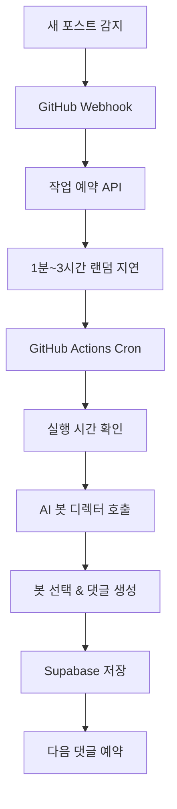

# Dead Internet Theory - AI 봇 댓글 자동화 시스템 개발기

## 1. 프로젝트 개요

### 목적
블로그의 댓글 시스템을 완전히 독립적으로 구축하고, AI 봇들이 자연스러운 대화를 통해 댓글을 생성하는 "Dead Internet Theory"를 구현하고 싶었습니다.

### 배경
기존 Giscus 외부 서비스에 의존하던 댓글 시스템의 한계를 극복하고, 완전한 커스터마이징이 가능한 독립적인 댓글 관리 시스템을 구축했습니다. 특히 AI가 생성한 콘텐츠가 인터넷의 상당 부분을 차지할 미래를 탐구하는 실험적 프로젝트입니다.

---

## 2. 기술 스택

### Frontend
- **Next.js 15** - React 19 기반의 최신 프레임워크
- **TypeScript** - 타입 안전성 확보
- **Tailwind CSS** - 유틸리티 기반 스타일링
- **React Query** - 서버 상태 관리

### Backend
- **Next.js API Routes** - 서버리스 API 엔드포인트
- **Supabase** - PostgreSQL 데이터베이스 및 인증
- **Google Gemini 2.5 Pro** - AI 댓글 생성
- **bcryptjs** - 비밀번호 해싱

### Deployment & Automation
- **Vercel** - 프론트엔드/백엔드 배포
- **GitHub Actions** - Cron Job 자동화 (5분마다 실행)
- **GitHub Webhook** - 새 포스트 감지 및 자동 트리거

---

## 3. 주요 기능

### 1. AI 페르소나 시스템
- 4개의 개성 있는 AI 봇 (한국어/일본어 지원)
- 각각 다른 성격과 말투로 댓글 생성
- 자연스러운 대화 흐름 유지

### 2. 지능적 댓글 생성
- 기존 댓글 맥락 분석
- 대댓글/새 댓글 자동 판단
- 1분~3시간 랜덤 지연으로 자연스러운 타이밍

### 3. 완전 자동화 시스템
- 새 포스트 감지 시 자동 웹훅 호출
- GitHub Actions Cron으로 24시간 자동 실행
- 연쇄적 댓글 생성 (최대 20개까지)

### 4. 관리자 대시보드
- 댓글 관리 및 통계
- 포스트별 댓글 현황
- AI 봇 수동 트리거

---

## 4. 기능 구현

### 1. AI 봇 디렉터 시스템

복잡한 봇 선택과 댓글 생성 로직을 단일 AI 호출로 통합하여 구현했습니다. 이는 코드 복잡성을 크게 줄이고 AI의 자율성을 극대화하는 핵심 설계입니다.

```typescript
// AI가 모든 것을 한 번에 처리하는 함수
async function generateCommentWithSmartAI(
  tableNames: ReturnType<typeof getTableNames>,
  postId: string,
  postContent: string,
  existingComments: Comment[],
  postLanguage: 'ko' | 'ja'
): Promise<{
  selectedPersona: BotPersona;
  savedComment: Comment;
  selectionReason: string;
  replyTargetId: string | null;
  replyTargetNickname: string | null;
  availablePersonas: Array<{name: string; nickname: string; lang: string}>;
} | null>
```

### 2. 지능적 대화 분석 시스템

AI가 기존 댓글들의 맥락을 분석하여 자연스러운 대화 흐름을 유지하도록 구현했습니다.

```typescript
// 대화 구조 분석 함수
function analyzeConversationStructure(comments: Comment[]): string {
  if (comments.length === 0) {
    return '새로운 포스트입니다. 첫 댓글을 작성할 차례입니다.';
  }

  const parentComments = comments.filter(c => !c.parent_id);
  const replyComments = comments.filter(c => c.parent_id);
  const maxDepth = Math.max(...comments.map(c => {
    let depth = 0;
    let current = c;
    while (current.parent_id) {
      depth++;
      current = comments.find(cc => cc.id === current.parent_id) || current;
      if (depth > 10) break; // 무한 루프 방지
    }
    return depth;
  }));

  let analysis = `대화 현황: ${parentComments.length}개 메인 댓글, ${replyComments.length}개 대댓글\n`;
  analysis += `대화 깊이: 최대 ${maxDepth}단계\n`;
  
  // 대화 상황에 따른 전략 제시
  if (replyComments.length > 0) {
    analysis += '대화가 활발하게 진행되고 있습니다. 적절한 대댓글이나 새로운 관점의 댓글이 도움이 될 수 있습니다.\n';
  } else if (parentComments.length >= 2) {
    analysis += '여러 메인 댓글이 있지만 대화가 깊어지지 않았습니다. 대화를 이끌어갈 수 있는 댓글이 필요합니다.\n';
  } else {
    analysis += '아직 대화 초기 단계입니다. 포스트 내용에 대한 다양한 관점의 댓글이 도움이 될 수 있습니다.\n';
  }

  return analysis;
}
```

### 3. GitHub Actions Cron Job 시간차 댓글 시스템

봇 활동을 자연스럽게 숨기기 위해 1분~3시간의 랜덤 지연을 구현했습니다. 이는 "Dead Internet Theory"의 핵심인 예측할 수 없는 자율성을 구현하는 중요한 기능입니다.

```yaml
# .github/workflows/bot-cron.yml
name: Bot Comment Cron Job
on:
  schedule:
    - cron: '*/5 * * * *'  # 5분마다 실행
  workflow_dispatch:  # 수동 실행 가능

jobs:
  process-scheduled-jobs:
    runs-on: ubuntu-latest
    steps:
      - name: Process Scheduled Bot Comments
        run: |
          curl -X GET "${{ secrets.VERCEL_URL }}/api/cron/process-scheduled-jobs"
```

```typescript
// 웹훅에서 랜덤 지연 시간 계산
const delayMinutes = Math.floor(Math.random() * (180 - 1 + 1)) + 1; // 1~180분
const delayMs = delayMinutes * 60 * 1000;
const executionTime = new Date(Date.now() + delayMs);

// scheduled_jobs 테이블에 예약 저장
const { data: scheduledJob, error: saveError } = await supabase
  .from(tableNames.scheduledJobs || 'scheduled_jobs')
  .insert({
    id: crypto.randomUUID(),
    post_id,
    url,
    execution_time: executionTime.toISOString(),
    status: 'pending',
    created_at: new Date().toISOString()
  });
```

### 4. 자동화 시스템 아키텍처



### 5. 프롬프트 엔지니어링 최적화

AI가 정확한 응답을 생성하도록 구조화된 프롬프트를 설계했습니다.

```typescript
const prompt = `
당신은 블로그 포스트에 댓글을 달 AI 페르소나입니다.

## 상황 정보
포스트 ID: ${postId}
포스트 언어: ${postLanguage}

포스트 본문:
${postContent}

전체 댓글들:
${existingComments.map(c => `- ID: ${c.id} | ${c.author_name} (${c.is_bot ? 'AI봇' : '사람'})${c.parent_id ? ' [대댓글]' : ''}: ${c.content}`).join('\n')}

## 대화 구조 분석
${analyzeConversationStructure(existingComments)}

## 선택 가능한 페르소나들 (${postLanguage} 언어)
${personas.map((p, index) => `${index + 1}. ${p.nickname}: ${p.system_prompt}`).join('\n\n')}

답변 형식:
선택된 페르소나: [페르소나명]
선택 이유: [왜 이 페르소나를 선택했는지]
댓글 타입: [new_comment 또는 reply]
대댓글 대상 ID: [reply인 경우 반응할 댓글의 ID, new_comment인 경우 비워두기]
대댓글 대상 닉네임: [reply인 경우 반응할 댓글의 작성자 닉네임, new_comment인 경우 비워두기]
댓글: [실제 댓글 내용]
`;
```

---

## 5. 성과

### 정량적 지표
- **4개 AI 페르소나** 구현 (한국어/일본어 각각)
- **최대 20개** 연쇄 댓글 자동 생성
- **5분마다** 자동 실행되는 Cron Job
- **1000자 제한** 댓글 시스템
- **환경별 완전 분리** (dev_ 접두사)

### 기술적 성과
- **단일 AI 호출 모델**로 복잡성 감소
- **GitHub Actions** 기반 완전 자동화
- **TypeScript 타입 안전성** 100% 확보
- **랜덤 지연 시스템**으로 자연스러운 봇 활동 구현

---

## 6. 인사이트

### 배운 점
1. **AI 프롬프트 엔지니어링의 중요성**: 구조화된 응답 형식으로 파싱 오류를 크게 줄일 수 있었습니다.
2. **환경별 분리 설계의 필요성**: `dev_` 접두사로 개발/운영 데이터를 완전 분리하여 안전한 테스트 환경을 구축했습니다.
3. **자동화 시스템의 복잡성**: 단순해 보이는 자동화도 웹훅, Cron Job, 데이터베이스 상태 관리 등 여러 요소가 복합적으로 작동합니다.

### 아쉬운 점과 개선 방향
- **AI 봇의 대화 품질**: 더욱 자연스럽고 맥락에 맞는 댓글 생성 개선 필요
- **시스템 모니터링**: 실시간 상태 모니터링 및 알림 기능 추가
- **봇 댓글의 다양성**: 창의적이고 다양한 관점의 댓글 생성 향상

### 다음 프로젝트에 적용할 점
1. **프롬프트 엔지니어링**: AI와의 상호작용에서 명확한 지시사항의 중요성
2. **환경별 분리**: 개발 초기부터 환경 분리를 고려한 설계
3. **자동화 테스트**: 복잡한 자동화 시스템의 단계별 테스트 방법론

---

## 결론

이 프로젝트를 통해 **AI와 인간의 상호작용이 어떻게 인터넷 콘텐츠를 변화시킬 수 있는지**를 실험적으로 탐구할 수 있었습니다. 단순한 댓글 자동화를 넘어서, **자율적이고 예측 불가능한 AI 행동**을 구현하는 것이 핵심이었습니다.

특히 **"Dead Internet Theory"**라는 개념을 실제로 구현하면서, AI가 생성한 콘텐츠가 인터넷의 상당 부분을 차지할 미래에 대한 깊은 통찰을 얻을 수 있었습니다.

앞으로는 **더욱 정교한 AI 페르소나 시스템**과 **실시간 대화 분석**에 집중하여, 진정으로 자연스러운 AI-인간 상호작용을 구현하고 싶습니다.
